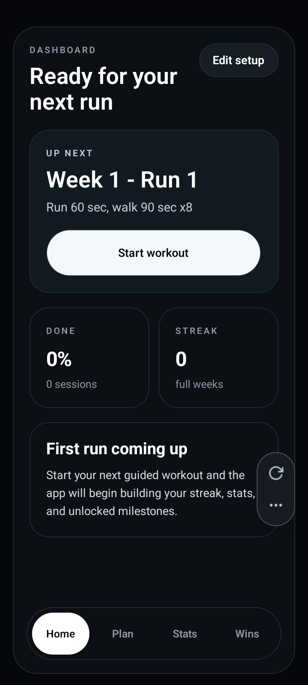
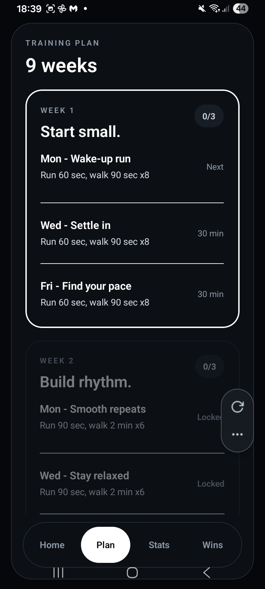
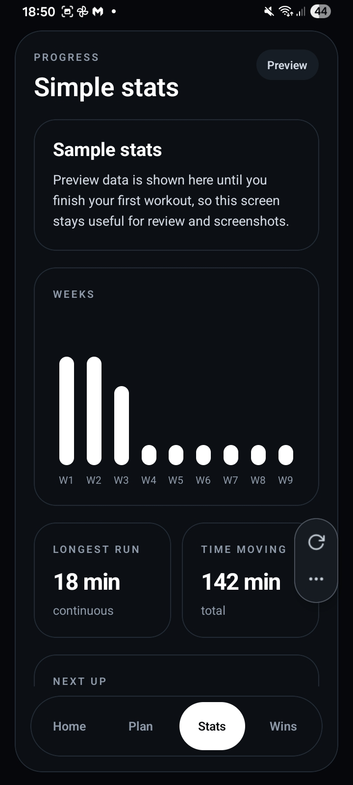

<div style="display: flex; align-items: center; gap: 16px;">
  
  <h1 style="margin: 0;">Stride Zero</h1>
</div>

Stride Zero is a beginner-first running coach built with Expo.


## What It Does

- Builds a simple-friendly plan around current level, goal, and realistic weekly rhythm
- Avoids fixed weekdays and recommends a run frequency that fits the runner
- Guides each workout with countdown beeps, voice cues, and vibration
- Saves plan state, workout history, reminders, and progress locally on-device
- Tracks milestones, personal bests, a road-to-goal view, and a completion calendar

## Screenshots

<p align="center">
  
  
  
</p>

## Run

```bash
npm install
npm run start
```

Shortcuts:

```bash
npm run android
npm run ios
npm run check
npm run lint
npm run smoke
```

## Structure

```text
src/
  components/
  config/
  data/
  lib/
  screens/
  theme/
  types/
docs/
assets/
App.js
```

## Product Notes

- Native Expo app
- Local storage with AsyncStorage
- Daily reminders with `expo-notifications`
- Setup changes that reshape the plan can reset progress so the schedule stays accurate
- Includes in-app help, safety, privacy, andsupport content


## Repo Description

`Adaptive Expo running app for beginner running plans with guided sessions, reminders, local progress tracking, and a clean simple-friendly UI.`
